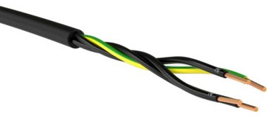

# Stepper Motors

The NEMA 17 stepper motors used with Farmbot are so-called *closed-loop motors*, because the consist of an open loop motor combined with a rotary motor encoder. The encoder reads the steps taken by the motor and gives feedback used for speed and/or position control.

There are two possibilities to purchase closed-loop stepper motors

* all-in-one closed loop motor from a single vendor
* double-shaft open loop motor from one vendor and an encoder module from another vendor that is mounted onto the rear shaft

## Official Farmbot parts
The official parts are hard to get due to minium order quanties of >= 20 pieces.
* [1704HS168A](http://motechmotor.com/productDetail-0104-32.html) from Motech with rear shaft option
* [HS28A](http://global.honestsensor.com.tw/pdf/HS28A_en.pdf) from Honest Sensor

## Alternative NEMA 17 closed-loop stepper motors
Only those listed with best price-performance relationship and minimum order quantity of one item at the respective Sales platforms such as amazon.com, aliexpress.com etc.

|Motor & Encoder properties|[1704HS168A](http://motechmotor.com/productDetail-0104-32.html) stepper with [HS28A](http://global.honestsensor.com.tw/pdf/HS28A_en.pdf) encoder (Farmbot default)|[17HS15-1504-ME1K](https://www.omc-stepperonline.com/closed-loop-stepper-motor/nema-17-closed-loop-stepper-motor-45ncm-64oz-in-with-magnetic-encoder-1000ppr-4000cpr.html)|[17HS19-2004-ME1K](https://www.omc-stepperonline.com/nema-17-closed-loop-stepper-motor-59ncm-84oz-in-with-magnetic-encoder-1000ppr-4000cpr.html)|
|-|-|-|-|
|Vendor|Motech|OMC Corporation Limited|OMC Corporation Limited|
|Phases|2|2|2|
|Step Angle|1.8deg / 200 steps per revolution|1.8deg / 200 steps per revolution|1.8deg / 200 steps per revolution|
|Holding Torque|77 oz. in|63.7 oz. in|79.3 oz. in|
|Rated Current/phase|1.68A|1.5A|2.0A|
|Rated Voltage *|2.8 VDC|2.8 VDC?|2.8 VDC|
|Frame Size|42 x 42mm|42 x 42mm|42 x 42mm|
|Body Length|48mm motor (+ 13mm encoder) |43.5mm|51.5mm|
|Shaft Dianter|5mm|5mm|5mm|
|Shaft Length|24mm|24mm|24mm|
|Weight|0.35kg|0.3kg|0.4kg|
|Motor Connector|
|Encoder Output Circuit Type|Differential|Differential|Differential
|Encoder Type|Incremental Optical|Incremental Magnetic|Incremental Magnetic|
|Encoder Resolution|max. 2.500 PPR|max. 1.000 PPR|max. 1.000 PPR|
|Encoder Output Channels|3 channels|3 channels|3 channels|
|Encoder Connector|
|Encoder Supply Voltage|4.5 - 5.5 VDC|3.3 - 5.5. VDC|3.3 - 5.5. VDC|

\* Please note, steppers are current-driven devices. That means the rated voltage is specifying the minimum voltage needed to move a stepper. It is not the maximum voltage. Usually steppers are operated with driving voltages between 12 and 24 VDC.

## Assembly of motor cables

you are going to manufacture [four motor cables](https://genesis.farm.bot/v1.6/bom/electronics-and-wiring/motor-cable#).

* 3 x motor-to-Farmduino cables of different lengths; ```X1```, ```X2```, ```Y```
* 1 x motor-to-Farmduino cable split into two parts; ```ZY``` + ```ZZ```

BOM

|Item|Amount|Description|Outdoor use (if applicable)|Source|
|-|-|-|-|-|
|Cable|1|```4 x 18 AWG (0.823mm²)```, about ```11m``` length, ```4x0.75mm²``` diameter|<ul><li>harmonized cable ```H05RN-F``` or ```H07RN-F``` made from rubber or</li><li>standardized UV-resistant PVC control cables ```YSLY-OZ``` or ```YSLY-JZ``` cable</li>|Home store / Online shop, e.g. LAPP ÖLFLEX® CLASSIC BLACK 110|
|Farmduino Connector|4|SL Crimp Housing, Single Row, Version G, Positive Latch, ```4``` Circuits, Black|electronics box housing the Farmduino should be waterproof|[Mouser](https://www.mouser.de/ProductDetail/538-50-57-9404), Digi-Key, etc.|
|Motor connector, option 1|4|Assuming motor comes with open end cable, use an ```M20``` cable connector| ```M20 IP68``` waterproof cable connector|Home store / online shop|
|Motor connector, option 2|4|Assuming motor comes with open end cable, you can crimp the cable with heat shrink butt connectors; requires special crimp tool and a random heat gun|use watertight shrink butt connectors|Home store / online shop|